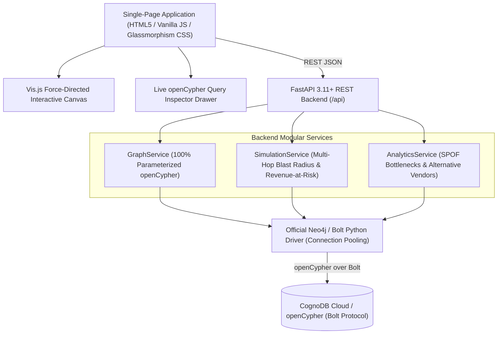

# 🛡️ GraphGuard: Global Supply Chain Risk & Cascading Failure Simulator

[](https://www.python.org/downloads/)
[](https://fastapi.tiangolo.com)
[](https://neo4j.com/developer/python/)
[](https://visjs.org/)
[](https://opensource.org/licenses/MIT)

> **High-Stakes Placement Take-Home Project for Wexa AI**  
> A production-grade, full-stack Graph Database Web Application backed by **CognoDB Cloud** (openCypher over Bolt protocol via the official `neo4j` Python driver) and **Python FastAPI**.

---

## 1. Domain & Problem Statement

### Why Graph Databases for Supply Chain Risk?
Modern supply chains are deep, multi-tier dependency networks rather than simple flat tables:
- **Arbitrary-Depth Recursive BOM (Bill of Materials)**: In relational databases, traversing multi-level component trees (`Wafer -> Lithography Optics -> ASML`, `Wafer -> AI SoC -> Server Pod`) requires expensive, recursive SQL joins (`WITH RECURSIVE`) that degrade exponentially with depth.
- **Cascading Blast Radius Calculations**: When an outage strikes a tier-1 supplier or a geopolitical region (e.g. Taiwan or Western Europe), GraphGuard evaluates the multi-hop transitive closure in real-time to compute affected sub-assemblies and aggregate quarterly revenue-at-risk.
- **Single Point of Failure (SPOF) Traversal**: Natural graph degree algorithms identify components with `in-degree(SUPPLIES) == 1` and trace their downstream paths to revenue-critical end products.

---

## 2. System Architecture



---

## 3. Graph Schema & Realistic Domain Dataset

The seed dataset features **44 curated nodes** across 5 distinct domains and **70 typed relationships** (114 total graph elements) modeling real-world high-tech supply chains:

### Labeled Nodes (44 Total)
- **`Supplier`** (14 nodes): `id`, `name`, `country`, `tier` (`Tier-1`, `Tier-2`, `Tier-3`), `risk_score` (1-100), `lead_time_days`
- **`Component`** (13 nodes): `id`, `name`, `category` (Silicon, Optical, Battery, Passive, Chassis), `criticality` (`Critical`, `High`, `Medium`, `Low`), `unit_cost_usd`
- **`Facility`** (7 nodes): `id`, `name`, `type` (`Foundry`, `Assembly`, `Testing`), `country`
- **`Region`** (6 nodes): `id`, `name`, `geopolitical_risk_index` (1-100)
- **`Product`** (4 nodes): `id`, `name`, `category` (Smartphone, AI Server, EV, Drone), `quarterly_revenue_millions`, `target_market`

### Typed Relationships (70 Total)
- `(:Supplier)-[:SUPPLIES {reliability_score: float, lead_time_days: int}]->(:Component)` (20 edges)
- `(:Component)-[:DEPENDS_ON {quantity_required: int}]->(:Component)` (5 recursive edges)
- `(:Component)-[:ASSEMBLED_INTO {units_per_product: int}]->(:Product)` (17 edges)
- `(:Facility)-[:MANUFACTURES]->(:Component)` (7 edges)
- `(:Supplier)-[:LOCATED_IN]->(:Region)` (14 edges)
- `(:Facility)-[:LOCATED_IN]->(:Region)` (7 edges)

---

## 4. Key openCypher Query Catalog (100% Parameterized)

### 1. Multi-Hop Cascading Blast Radius (Supplier Outage)
```cypher
MATCH (s:Supplier {id: $supplier_id})
MATCH path = (s)-[:SUPPLIES]->(c:Component)-[:DEPENDS_ON*0..3]->(sub:Component)-[:ASSEMBLED_INTO]->(p:Product)
RETURN s, c, sub, p, path
```

### 2. Regional Disruption Impact (Geopolitical / Natural Disaster)
```cypher
MATCH (r:Region {id: $region_id})
MATCH (s:Supplier)-[:LOCATED_IN]->(r)
MATCH path = (s)-[:SUPPLIES]->(c:Component)-[:DEPENDS_ON*0..3]->(sub:Component)-[:ASSEMBLED_INTO]->(p:Product)
RETURN r, s, c, sub, p, path
```

### 3. Single Point of Failure (SPOF) Bottleneck Detection
```cypher
MATCH (c:Component)
OPTIONAL MATCH (s:Supplier)-[:SUPPLIES]->(c)
WITH c, count(DISTINCT s) AS supplier_count, collect(s.name) AS suppliers
WHERE supplier_count = 1
OPTIONAL MATCH (c)-[:DEPENDS_ON*0..3]->(sub:Component)-[:ASSEMBLED_INTO]->(p:Product)
RETURN c.id AS component_id, c.name AS component_name, c.category AS category,
       c.criticality AS criticality, c.unit_cost_usd AS unit_cost_usd,
       supplier_count, suppliers, count(DISTINCT p) AS affected_products_count,
       collect(DISTINCT p.name) AS affected_products,
       sum(DISTINCT p.quarterly_revenue_millions) AS revenue_at_risk
ORDER BY revenue_at_risk DESC, c.unit_cost_usd DESC
```

### 4. Alternative Vendor Recommendations
```cypher
MATCH (target:Component {id: $component_id})
MATCH (alt_s:Supplier)-[rel:SUPPLIES]->(target)
WHERE ($disrupted_supplier_id IS NULL OR alt_s.id <> $disrupted_supplier_id)
MATCH (alt_s)-[:LOCATED_IN]->(r:Region)
RETURN alt_s.id AS supplier_id, alt_s.name AS supplier_name, alt_s.country AS country,
       alt_s.tier AS tier, alt_s.risk_score AS risk_score, rel.lead_time_days AS lead_time_days,
       rel.reliability_score AS reliability_score, r.name AS region_name, r.geopolitical_risk_index AS region_risk
ORDER BY alt_s.risk_score ASC, rel.reliability_score DESC
```

---

## 5. Getting Started & Installation

### Prerequisites
- Python 3.11 or higher
- pip

### 1. Clone & Install Dependencies
```bash
git clone <repository_url>
cd "CongoDB Supply Chain"
pip install -r requirements.txt
```

### 2. Configure Environment Variables
Copy `.env.example` to `.env`:
```bash
cp .env.example .env
```
Edit `.env` with your CognoDB Cloud / Bolt credentials:
```ini
COGNO_URI=bolt://localhost:7687
COGNO_USER=neo4j
COGNO_PASSWORD=password
DATABASE_NAME=neo4j
APP_ENV=development
PORT=8000
HOST=0.0.0.0
ENABLE_DEMO_FALLBACK=true
```

> **Note**: If CognoDB credentials are not provided or the remote instance is starting up, GraphGuard automatically activates its **In-Memory Simulation Fallback Engine** so all features, simulations, and Cypher telemetry queries are instantly demonstrable.

### 3. Run the Application
```bash
python -m uvicorn main:app --host 127.0.0.1 --port 8000
```
Open your browser to: **`http://127.0.0.1:8000`**

### 4. Run Automated Test Suite
```bash
python -m pytest tests/ -v
```

---

## 6. Frontend Key Features

- **Interactive Force-Directed Network Graph**: Real-time physics, pan, zoom, click-to-inspect node properties, custom shapes and color coding.
- **Live Disruption Simulator**: Select any supplier or region and trigger a multi-hop cascading failure with glowing blast radius animations and revenue-at-risk calculations.
- **SPOF Detector Dashboard**: Identifies single-source vulnerabilities with 1-click focus and alternative vendor searches.
- **Alternative Vendor Finder**: Multi-factor supplier ranking evaluating lead time, reliability score, and geopolitical risk.
- **Live openCypher Inspector Drawer**: Expandable slide-out drawer showing exact parameterized queries, execution latency in milliseconds, parameter JSON, and copy-to-clipboard.
